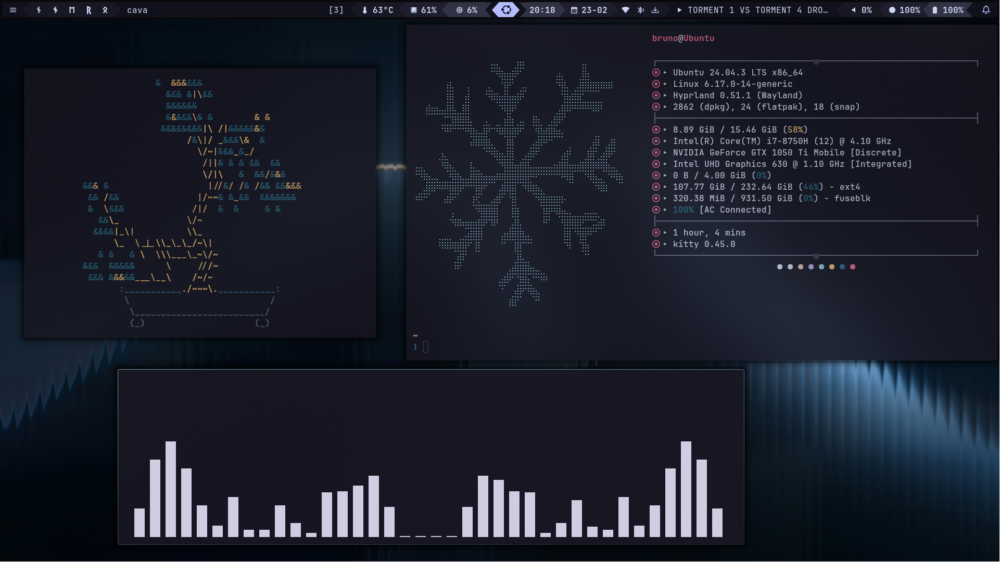
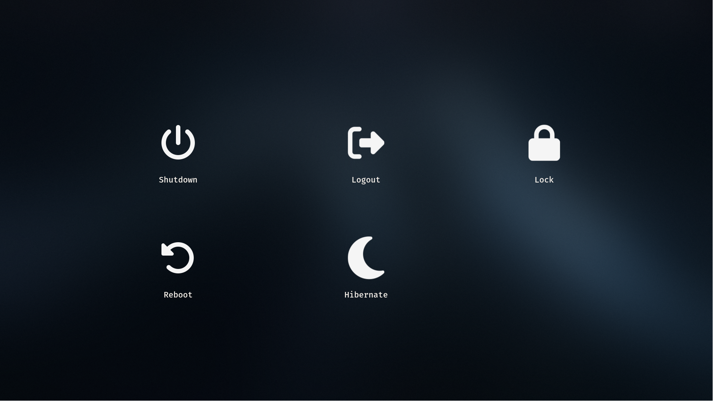

# bait's Hyprland dotfiles
This repository contains my Hyprland configuration and related dotfiles. It is organized so you can reuse the compositor settings, UI (waybar / wofi / wlogout) styling, terminal config, and Fastfetch flavors.

## Quick links
- Shells and env:
  - [`.zshrc`](.zshrc)
  - [`.bashrc`](.bashrc)
  - [`.gitignore`](.gitignore)
- Hyprland:
  - [`hyprland.conf`](.config/hypr/hyprland.conf) (contains variables like [`$terminal`](.config/hypr/hyprland.conf), [`$menu`](.config/hypr/hyprland.conf))
  - [`hyprpaper.conf`](.config/hypr/hyprpaper.conf)
  - [`hyprlock.conf`](.config/hypr/hyprlock.conf)
- Bar / UI:
  - [`waybar/config`](.config/waybar/config)
  - [`waybar/style.css`](.config/waybar/style.css)
  - [`wofi/style.css`](.config/wofi/style.css)
- Logout screen:
  - [`wlogout/layout`](.config/wlogout/layout)
  - [`wlogout/style.css`](.config/wlogout/style.css)
- Terminal:
  - [`alacritty.toml`](.config/alacritty/alacritty.toml)
- Fastfetch (neofetch-like):
  - [`config.jsonc`](.config/fastfetch/config.jsonc)
  - [`config-v2.jsonc`](.config/fastfetch/config-v2.jsonc)
  - [`config-pokemon.jsonc`](.config/fastfetch/config-pokemon.jsonc)
  - [`config-compact.jsonc`](.config/fastfetch/config-compact.jsonc)
  - ASCII art: [`ascii/v1.txt`](.config/fastfetch/ascii/v1.txt)
- Audio visualizer:
  - [`cava/config`](.config/cava/config)

## How this is organized
- Core compositor config: see [`.config/hypr/hyprland.conf`](.config/hypr/hyprland.conf). Variables like [`$terminal`](.config/hypr/hyprland.conf) and [`$fileManager`](.config/hypr/hyprland.conf) let you swap apps globally.
- Lock and wallpaper: [`hyprlock.conf`](.config/hypr/hyprlock.conf) and [`hyprpaper.conf`](.config/hypr/hyprpaper.conf).
- Waybar modules & styling: [`.config/waybar/config`](.config/waybar/config) and [`.config/waybar/style.css`](.config/waybar/style.css).
- Fastfetch flavors live under `.config/fastfetch/` and include PNG/ASCII assets.

## Desktop screenshots

  
Desktop

  

  Notes:
  - Which monitor: e.g. 1920x1080
  - Special tweaks: e.g. custom shadow / blur in [`hyprland.conf`](.config/hypr/hyprland.conf)

  
Waybar

  

  - Config: [`.config/waybar/config`](.config/waybar/config)
  - Style: [`.config/waybar/style.css`](.config/waybar/style.css)

  
Lock screen (Hyprlock)

  

  - Lock config: [`.config/hypr/hyprlock.conf`](.config/hypr/hyprlock.conf)
  - Background: [`.config/hypr/hyprpaper.conf`](.config/hypr/hyprpaper.conf)

## Notes
  - Wallpaper shown in screenshots is saved at `images/wallpaper.png`