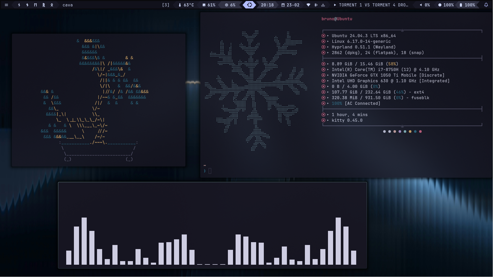
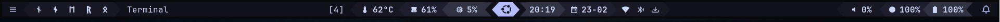
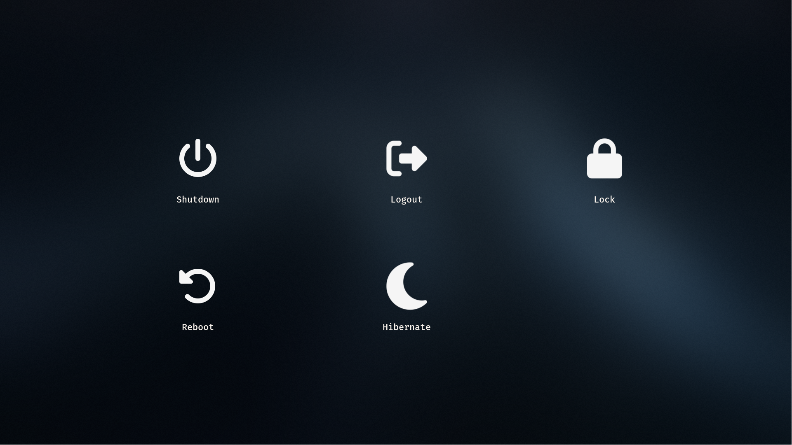

# bait's Hyprland dotfiles
This repository contains my Hyprland configuration and related dotfiles. It is organized so you can reuse the compositor settings, UI (waybar / wofi / wlogout) styling, terminal config, and Fastfetch flavors.

## Quick links
- Shell and env:
  - [`.zshrc`](.zshrc)
  - [`.gitignore`](.gitignore)
  - [`starship.toml`](.config/starship.toml)
  - [`atuin/config.toml`](.config/atuin/config.toml)
- Hyprland:
  - [`hyprland.conf`](.config/hypr/hyprland.conf)
  - [`monitors.conf`](.config/hypr/monitors.conf)
  - [`workspaces.conf`](.config/hypr/workspaces.conf)
  - [`hyprpaper.conf`](.config/hypr/hyprpaper.conf)
  - [`hyprlock.conf`](.config/hypr/hyprlock.conf)
- Bar / UI:
  - [`waybar/config.jsonc`](waybar/config.jsonc)
  - [`waybar/style.css`](waybar/style.css)
  - [`wofi/config`](.config/wofi/config)
  - [`wofi/style.css`](.config/wofi/style.css)
- Notifications:
  - [`swaync/style.css`](.config/swaync/style.css)
- Logout screen:
  - [`wlogout/layout`](.config/wlogout/layout)
  - [`wlogout/style.css`](.config/wlogout/style.css)
- Terminal:
  - [`kitty/kitty.conf`](.config/kitty/kitty.conf)
- System monitor:
  - [`btop/btop.conf`](.config/btop/btop.conf)
- Fastfetch (neofetch-like):
  - [`config.jsonc`](.config/fastfetch/config.jsonc)
  - [`config-v2.jsonc`](.config/fastfetch/config-v2.jsonc)
  - [`config-pokemon.jsonc`](.config/fastfetch/config-pokemon.jsonc)
  - [`config-compact.jsonc`](.config/fastfetch/config-compact.jsonc)
  - ASCII art: [`ascii/v1.txt`](.config/fastfetch/ascii/v1.txt)
- Audio visualizer:
  - [`cava/config`](.config/cava/config)

## How this is organized
- Core compositor config: [`hyprland.conf`](.config/hypr/hyprland.conf), with monitor and workspace rules split into [`monitors.conf`](.config/hypr/monitors.conf) and [`workspaces.conf`](.config/hypr/workspaces.conf).
- Lock and wallpaper: [`hyprlock.conf`](.config/hypr/hyprlock.conf) and [`hyprpaper.conf`](.config/hypr/hyprpaper.conf).
- Waybar lives under [`waybar/`](waybar/) at the repository root and includes its own modules, scripts, styles, and themes.
- Fastfetch flavors live under `.config/fastfetch/` and include PNG/ASCII assets.

## Desktop screenshots

  
Desktop

  

  
Waybar

  

  - Config: [`waybar/config.jsonc`](waybar/config.jsonc)
  - Style: [`waybar/style.css`](waybar/style.css)

  
Lock screen (Hyprlock)

  

  - Lock config: [`hyprlock.conf`](.config/hypr/hyprlock.conf)
  - Background: [`hyprpaper.conf`](.config/hypr/hyprpaper.conf)

## Notes
  - Wallpaper shown in screenshots is saved at `images/wallpaper.jpg`
